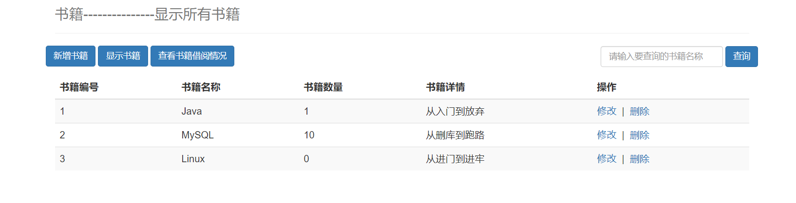
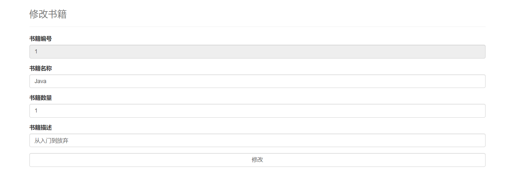
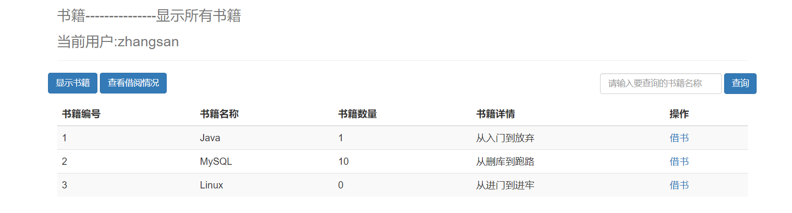
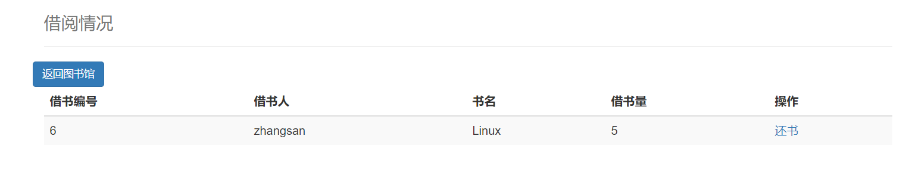

# 基于SSM框架整合的图书管理系统

工作环境：JDK1.8,Spring,SpringMVC,Mybatis

系统主要完成的功能有：

1.admin账号能新增，修改书籍详情，可以查看借书情况，能进行删除书籍等CRUD操作功能。

2.使用其他用户登陆，账号只能进行借书，还书，搜索书籍等功能，对删除书籍和修改书籍没有权限。

3.使用了mvc自带的过滤器，能禁止直接通过地址栏访问资源，只能通过登陆或或者注册账号后进入图书馆主页面。

admin账号：admin
密码：123456

端口号：http://localhost:8080/

dataBase:library

